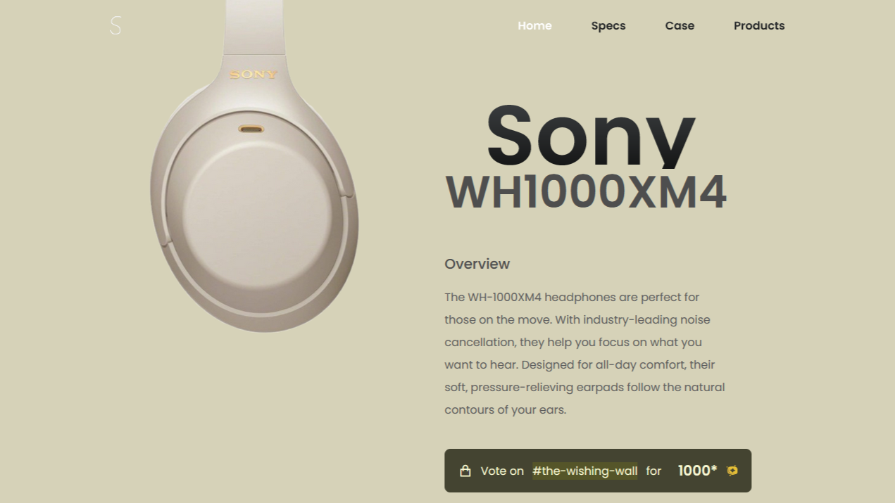

# 🎧 Sony WH-1000XM4

## Overview ✨
Welcome to the official repository for the **Sony WH-1000XM4**! These industry-leading noise-canceling headphones are designed to deliver an unparalleled audio experience. Whether you're a music lover, a frequent traveler, or someone who just wants some peace and quiet, the WH-1000XM4 has got you covered.

## Preview 📸

## How You Can Help 🙏🏽

We need your support to get the **Sony WH-1000XM4** headphones available on High Seas Shop! If you love these headphones and want to see them on the store, please cast your vote and spread the word.

### How to Vote 🗳️

1. Open or join the [Hack Club Slack](https://hackclub.slack.com).
2. Visit [Soham's pitch on #the-wishing-wall](https://hackclub.slack.com/archives/C07443MC9UP/p1733316232831789).
3. Upvote and share your support.

### Spread the Word 📢

- Spread this website and repo README.
- Help us bring the Sony WH-1000XM4 on the High Seas Shop for an estimated 1000‒1500 Doubloons.

Together, we can make it happen! Thank you for your support. 🌊🎧

## The fun part — Material Design! 😋
> As it is quite visible, this website's design is inspired by the Material You design language by Google — with matching colors to rounded corners and animations. It looks like one of the most beautiful landing pages I have made — it uses no glassmorphism yet is stunning in my opinion.

## The rough part — Researching about the headphones¡ 🎊
> All I basically knew before making this landing page was that XM4s had awesome sound and ANC, but during the lroduction of this website, I had to research about pretty much everything — from driver size to ANC limits and capacity of battery, bluetooth version, IP ratings etc. And then finding the right images, adding them for responsive site and then finding Slack links for the pitch on #the-wishing-wall and even finding the link to my own Slack profile was something new I had to do and found some barriers along the way.

## Credits 🤝
**From online sources**: GitHub Copilot (to find some good color theming options as  a start), W3Schools and Mozilla Developer (MDN) (for hints for animations). 

**From other projects**: My own README template

---

